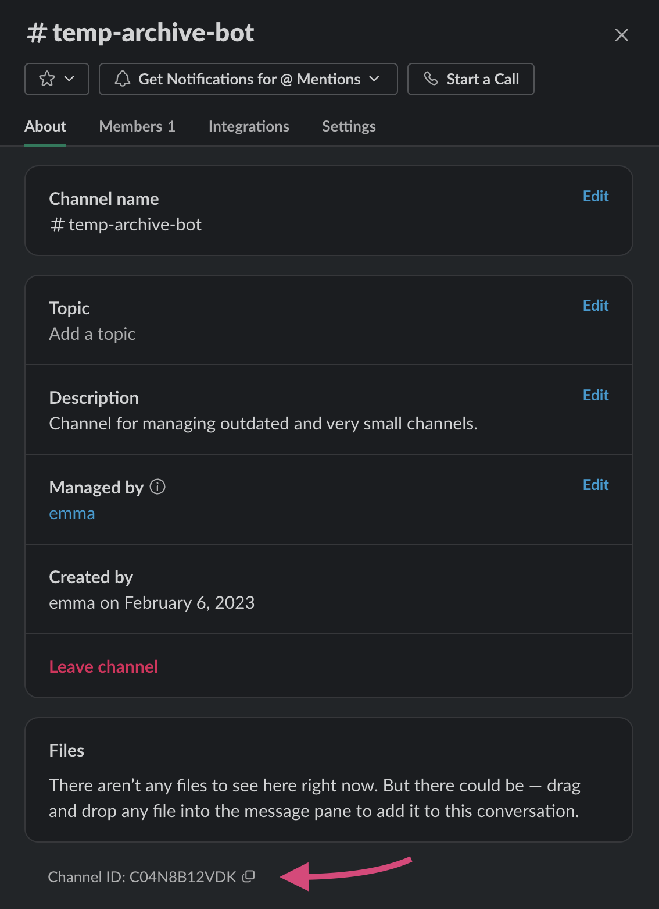

# Archive Bot

Slack bot helper for managing outdated and very small channels.

### Configuration

Archive bot needs a bit of data to get started:

- Slack API Key
- Notification Channel ID
- Filter Prefixes (optional)
- Messages (optional)
- Staleness (optional)
- Small Channel Threshold (optional)

```rust
let config = archive_bot::Config {
  token: env::var("SLACK_BOT_TOKEN").expect("Error: environment variable SLACK_BOT_TOKEN is not set."),
  notification_channel_id: "A01A02A03A04",
  filter_prefixes: vec!["-"],
  message_headers: vec![
    "Hey, you've got some cleaning up to do!",
    "Hey boss, take a look at these, will ya?",
  ],
  stale_after: 2 * 7 * 24 * 60 * 60,
  small_channel_threshold: 3,
};
```

Or, using default values:

```rust
let config = archive_bot::Config {
  token: env::var("SLACK_BOT_TOKEN").expect("Error: environment variable SLACK_BOT_TOKEN is not set."),
  notification_channel_id: "A01A02A03A04",
  ..Default::default();
};
```

### Setting Up Slack


### Finding Slack Channel ID

To find the ID of a Slack channel, you can click the channel name for more info and find it at the bottom.


